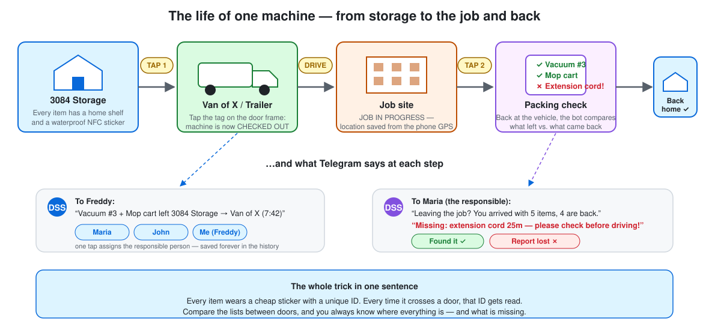
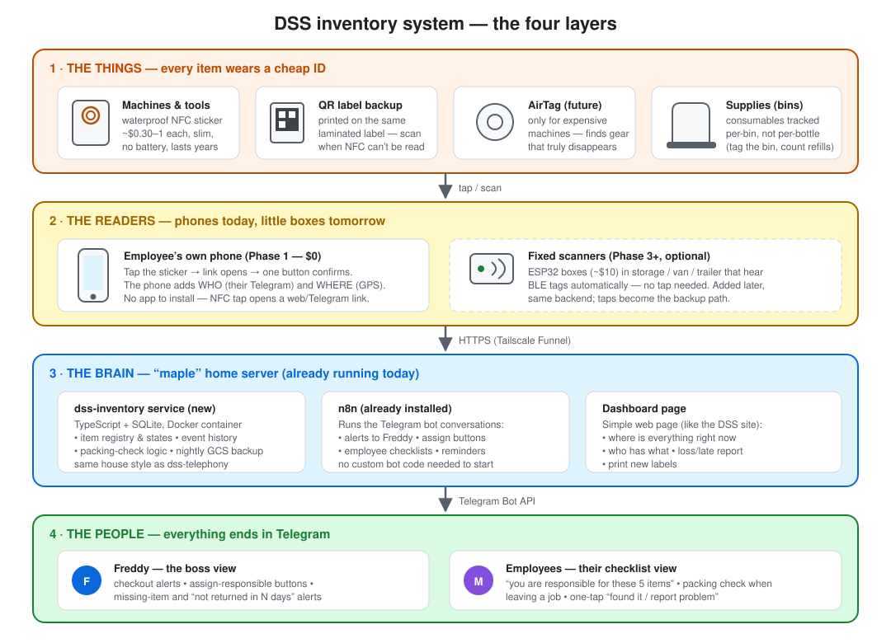

# DSS Inventory Tracking — from idea to implementation

> **Status: design phase.** Nothing here is built yet. This folder is the complete plan —
> hardware, software, architecture, costs, phases, risks and open questions — for the
> equipment-tracking idea Freddy described in August 2026. It was produced by researching
> the real physics, real 2025–2026 prices (with sources), and three competing designs that
> were scored against each other before writing this recommendation.

## The idea (as Freddy described it)

Equipment lives in **3084 Storage**. When something is taken out, the system should notice
automatically, alert Freddy on **Telegram**, let him assign a **responsible person**, mark the
equipment **job-in-progress** when it leaves the vehicle at a client site, and — the killer
feature — **check that nothing is missing** when the crew packs up, *so employees don't
forget anything*. Trackers must be **cheap, slim and water-resistant** (NFC-sticker style),
location can come from **the responsible person's phone**, it is an **inventory system, not
live GPS tracking**, and in the future **AirTags** could protect the expensive machines.

## The one-paragraph verdict

The idea is good and buildable **almost exactly as described** — with one correction from
physics: **an NFC sticker cannot be detected at a door.** NFC works at 1–10 *centimeters*
(it's a tap technology; NXP's own datasheet caps NTAG stickers at 100 mm, and a metal
garage door blocks the field entirely). The technology that really does "detect what passes
through the door" is UHF RFID — and a proper portal costs **CA$3,000–5,900 per door**,
which is not where DSS should start. So the plan keeps every part of the idea but splits the
job in two: **NFC stickers become the identity layer** (tap an item with any phone → the
Telegram bot knows exactly which item, who tapped it, and where the phone is), and
**autonomy comes later from small Bluetooth (BLE) beacons + ~$10 ESP32 listening boxes**
in the storage and vehicles — no taps needed, self-healing, ~CA$700–1,100 total, $0/month.
AirTags slot in at the end for the most expensive machines only.

## Cost summary

| Phase | What you get | One-time cost | Monthly |
|---|---|---|---|
| 0 — Census | Complete equipment register (photos, serials, values) — insurance-grade | $0 | $0 |
| 1 — NFC + Telegram bot | The **full workflow**: alerts, responsible person, packing check — via 3-second taps | ~CA$100–150 | $0 |
| 2 — Hardening | Door tap-station at 3084, batch loading, nightly safety-net digest, backups | ~CA$30–130 | $0 |
| 3 — BLE autonomy | No more taps: items detected automatically in storage/vans/trailer + after-hours alarm | ~CA$400–750 | $0 (optional LTE ~$15/mo/van) |
| 4 — AirTags | Find-my-network recovery for the 5–10 most expensive machines | ~CA$35–45 each | $0 |
| ~~UHF portal~~ | ~~True walk-through door detection~~ — parked unless DSS grows past ~15 people | ~~CA$3,000–5,900~~ | — |

## What's in this folder

| Document | Read it for |
|---|---|
| [docs/01-the-idea-explained.md](docs/01-the-idea-explained.md) | **Start here.** The whole system explained simply, with use-case stories and mind maps |
| [docs/02-hardware.md](docs/02-hardware.md) | Every tag, sticker, beacon and box: what to buy, what it costs, what NOT to buy — with sources |
| [docs/03-software-architecture.md](docs/03-software-architecture.md) | The backend service, database schema, item state machine, how it fits DSS's existing maple server |
| [docs/04-telegram-flows.md](docs/04-telegram-flows.md) | Every Telegram message, button and command, for Freddy and for the crew |
| [docs/05-roadmap.md](docs/05-roadmap.md) | The build plan, phase by phase, with effort, gates and what can go wrong |
| [docs/06-open-questions-and-risks.md](docs/06-open-questions-and-risks.md) | **Answer before ordering hardware.** 20 questions + the honest risk list (Quebec winter included) |
| [docs/07-sources.md](docs/07-sources.md) | All research sources: datasheets, price pages, standards, API docs |

## The system at a glance

## Three decisions already taken (and why)

1. **NFC = identity, not detection.** Cheap ($0.30–1.50), slim, waterproof, no battery —
   everything Freddy asked for — but physically a *tap* technology. Every item gets one
   regardless of phase; it is the permanent manual-override and audit path.
2. **BLE presence zones = the autonomy layer.** State is derived from "which zone sees the
   tag *now*" (storage / Van 1 / trailer), not from one-shot door events — so a missed read
   self-heals in minutes instead of corrupting the database forever. Three independent
   design reviews scored this the winner on cost, reliability and fit with DSS's existing
   infrastructure (maple server, Docker, n8n, Tailscale).
3. **The backend is a sibling of `telephony-service`.** Same house style: TypeScript strict
   ESM, Express, SQLite, Docker on maple, Telegram via long polling (needs **zero** new
   public ports — all three Tailscale Funnel ports are already taken), extracted to its own
   repo before production, per the repo's own rule.
