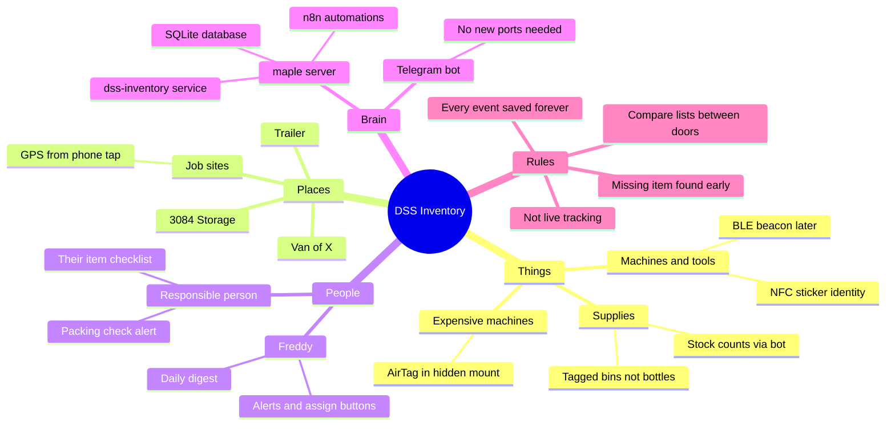
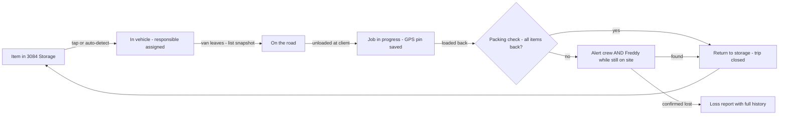

# The idea, explained simply

*This is the "explain it like we're 12" version. Everything here is expanded technically in
the other documents.*

---

## 1. The library-card trick

Think of how a library never loses a book, even with thousands of them and hundreds of
people borrowing:

1. Every book has a **sticker with a unique code**.
2. Every time a book **crosses the front desk**, the code gets read.
3. A computer keeps the list: *who* took *which book*, *when*, and *what came back*.

The library doesn't follow you home with a GPS tracker. It doesn't need to. It only needs
to notice the **moments the book changes hands** — and compare lists.

That is exactly this system, but for vacuums, floor machines, pressure washers, mop carts
and extension cords:

- Every item wears a **cheap waterproof sticker** with a unique ID (an NFC sticker, ~$0.30–1.50).
- Every time it crosses a "door" — leaves 3084 Storage, gets loaded in a van, comes back —
  that ID gets read.
- A small computer DSS already owns (the **maple** server) keeps the list and talks to
  everyone through **Telegram**.

**The magic is never in the sticker. It's in comparing the lists.**
If 6 items left storage this morning and 5 came back tonight, the system knows *exactly*
which one is missing, *who* was responsible, and *where it was last seen* — before the van
even leaves the client's parking lot.

## 2. Why the original "NFC at the door" needs one small fix

The original idea was: put an NFC sensor at the garage door, and it detects everything
carried through. Here is the honest physics, verified against manufacturer datasheets
(sources in [07-sources.md](07-sources.md)):

- An NFC sticker can only be read from **1–10 centimeters** away. It's the same technology
  as tapping your bank card — and you have to *tap* the terminal; waving your wallet at the
  shop's front door does nothing.
- A big **metal** garage door actually *blocks* the NFC field completely.
- The machines that read tags from meters away as you walk through (like store
  anti-theft gates or warehouse dock doors) are a different technology — **UHF RFID** —
  and a proper portal costs **CA$3,000–5,900 per door**, plus special on-metal tags, and
  still misses reads on wet metal machines (which is what cleaning equipment is).

So the plan keeps the sticker idea (it's the right idea!) and splits the work:

| Job | Technology | Cost |
|---|---|---|
| **"Which item is this, exactly?"** | NFC sticker + any phone tap (3 seconds, no app) | ~$0.30–1.50 per item |
| **"What is inside this room/van right now?"** (automatic, no taps) | BLE beacon tag + a ~$10 ESP32 listening box per zone | ~$4–8 per tag, ~$15 per zone |
| **"Where did my $4,000 machine end up?"** (worst case) | AirTag, expensive machines only | ~$30 each |
| ~~"What just walked through the door?"~~ | ~~UHF RFID portal~~ — parked; overkill at DSS's size | ~~$3,000+/door~~ |

## 3. The mind map

## 4. Six use cases, told as stories

### Story 1 — The morning load-out (the everyday case)

**6:45.** Maria loads the van for the Tour A job: floor machine, vacuum #3, mop cart,
extension cord, supplies caddy. As she loads, she taps each sticker with her phone —
3 seconds each, no app needed, the tap opens the DSS Telegram bot with the item
already recognized. One button: **"→ Van 1"**.

**6:52.** Freddy's phone buzzes once (not five times — the system groups it):
> 🚚 *Van 1 loading: 5 items — floor machine FM-01, vacuum VAC-03, mop cart CAR-02,
> cord EXT-04, caddy BIN-07. Responsible: **Maria** ✓ (she tapped) — [Change]*

Because Maria tapped with *her* phone, the system already knows the responsible person.
Freddy does nothing. The "assign responsible" step he imagined exists — but most days it
assigns itself.

### Story 2 — The forgotten extension cord (the killer feature)

**14:30.** Job done at Tour A. The crew loads the van back up and Maria taps the items
back in. She taps 4 items. The bot immediately answers **her** (not just Freddy):

> 🔁 *4 of 5 items back in Van 1.*
> ⚠️ ***Missing: extension cord EXT-04** — last event: unloaded at Tour A, 09:10.*
> *Please check before leaving! [Found it ✓] [Left on purpose 📍] [Can't find it ❌]*

The cord is still plugged in behind the lobby desk. Maria walks 40 meters and gets it.
**That cord used to be a $60 loss and a lost hour next week. Now it's a 2-minute walk.**
This is the "employees don't forget anything" feature — it fires *while the crew is still
on site*, which is the only moment the alert is truly useful.

### Story 3 — Where is the pressure washer?

**Tuesday.** Freddy needs the pressure washer. Instead of calling three people:

> Freddy: `/where PRESS-01`
> Bot: *PRESS-01 pressure washer — **In Van 2** since Monday 16:40. Responsible: David.
> Last location: tapped at "Complexe Y" Monday 09:15 (map pin). History: [View]*

The map pin came from the phone that tapped it — that's the "geo location given by the
phone of the responsible" idea, and it costs nothing.

### Story 4 — The nightly safety net

**20:00 every day**, the bot sends Freddy one short digest:

> 📋 *Tonight: 41 items in storage, 6 in Van 1 (Maria), 2 in Van 2 (David).*
> ⚠️ *VAC-02 has been "job in progress" for 26 h — [Ask David] [Fix]*
> 🧴 *Supplies: floor soap below minimum (2 left) — [Order noted]*

Even if somebody forgot a tap during the day, nothing stays wrong for more than 24 hours.
Missed taps become corrections, not lost equipment.

### Story 5 — Phase 3: the taps disappear

Six months in, DSS adds the little **BLE listening boxes**: one in storage, one per van,
one in the trailer, and coin-battery **beacon tags** on the machines. Now the machines
announce themselves every 2 seconds, and the boxes just *listen*:

- Machine leaves storage → noticed automatically (1–5 min later, no tap).
- It shows up in Van 1 → assigned to Van 1's trip automatically.
- It's absent from the van while the van is parked at a client → *job in progress*, automatic.
- Van leaves the site with a machine missing → **buzzer in the van sounds** even with zero
  cell coverage, and Telegram fires when there's signal.
- Anything leaves storage at 2 a.m. → 🚨 immediate alert (the after-hours alarm — the one
  genuine anti-theft feature, and it's nearly free).

The NFC stickers stay on every item forever as the manual override: when a battery dies or
a reading is wrong, a tap fixes it.

### Story 6 — The one that got away

A $4,500 autoscrubber left at a site, gone for a week. It has an **AirTag** hidden in a
screwed-down mount (Phase 4, expensive machines only). Any passing iPhone quietly reports
its location to Apple's network. Freddy opens Find My: it's in a janitor closet at
Complexe Y. Recovered. The AirTag paid for itself 150 times over.

## 5. What this system is NOT (on purpose)

- **Not live GPS tracking.** No location is recorded except the moment a tap happens or a
  zone changes. Nobody's movements are followed — items are.
- **Not an anti-theft system.** A thief can peel a sticker. This catches *honest loss* —
  the forgotten, the misplaced, the "I thought you had it" — which is where the real money
  disappears. (The after-hours storage alarm and AirTags are the two anti-theft touches.)
- **Not a per-bottle supply counter.** Consumables are tracked per **bin** ("tag the caddy,
  count the refills") plus simple stock counts in the bot. Tagging every spray bottle is a
  losing battle.
- **Not a discipline tool.** "Responsible" means "custodian", not "culprit". The system
  proves people *returned* things as much as it notices when they didn't. How this is
  presented to the crew matters — see [06-open-questions-and-risks.md](06-open-questions-and-risks.md).

## 6. The big picture, one more time

Every arrow in that diagram is one Telegram message or one automatic detection.
Every box is a state saved forever in the database. That's the whole system.

*Next: [02-hardware.md](02-hardware.md) — exactly what to buy, with prices and sources.*
