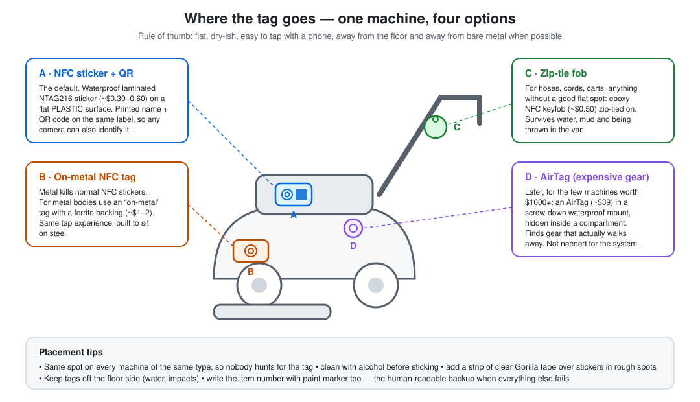

# Hardware — what to buy, what it costs, what NOT to buy

All prices are street prices researched August 2026 (single/small-quantity unless noted),
in **USD unless marked CAD** (CAD ≈ USD × 1.35–1.40 + taxes). RFID/beacon pricing moves —
re-quote before ordering. Full source URLs in [07-sources.md](07-sources.md).

---

## 1. Phase 1 — NFC identity layer (~CA$100–150 total)

The trackers Freddy asked for: **cheap, slim, waterproof, no battery**. NFC tags are
passive — powered by the phone that taps them — and last for years. Each tag's chip stores
a link like `https://t.me/DssInventoryBot?start=i-VAC03`: tapping it opens the DSS bot with
the item pre-loaded. **No app to install** (verified: Android reads NFC natively; iPhone XS
and newer read in the background).

| Item | For | Example product class | Unit price | Qty | Line |
|---|---|---|---|---|---|
| **On-metal NFC tag** (NTAG213/216, ferrite-backed, waterproof face) | Machines with metal bodies — ordinary stickers go **dead on metal** | Timeskey anti-metal NTAG213 (10-packs $10–15) | $1.00–1.50 | 30 | $35–45 |
| **NFC sticker** (NTAG215, 25 mm, laminated) | Plastic-bodied tools, carts, bins | Timeskey / THONSEN 50-pack $13–18 | ~$0.30 | 50 | $16 |
| **Epoxy NFC keyfob with zip-tie hole** | Hoses, cords, anything without a flat spot | Generic epoxy fob | $0.50–1 | 20 | $14 |
| **Printed backup label** (item code + QR) | *Every* item — the fallback when NFC fails or a battery phone can't tap | Brother P-touch + laminated tape (or Sharpie = $0) | — | 1 | CA$40–60 |

**Placement rules** (see image above): same spot on every machine of the same type; clean
with alcohol first; flat surface, away from the floor side and spray paths; clear Gorilla
tape over stickers in rough spots; write the item code with paint marker too.
NFC at 13.56 MHz tolerates **water** well — the enemy is **metal** (use the ferrite-backed
tags) and **impacts** (budget ~10%/year replacement; a dead tag is recoverable via its
printed code).

## 2. Phase 2 — Fixed tap station at 3084 (~CA$30–130)

For staff whose phone has no NFC, and to make storage in/out a no-phone, one-tap gesture.

- **Option A (DIY, ~CA$30):** ESP32 DevKit ($5–10) + PN532 NFC reader module ($5–8) +
  IP65 junction box + USB supply. Posts tag UIDs over the garage Wi-Fi to maple
  (LAN/Tailscale — no public exposure).
- **Option B (~CA$60–130):** a used Android phone (Moto G class) wall-mounted in kiosk
  mode running the same tap flow.
- **Worth adding here:** a $3 reed contact on the garage door wired to the same ESP32 —
  "door opened outside business hours" alert costs almost nothing and is real security value.

## 3. Phase 3 — BLE autonomy layer (~CA$400–750 one-time, $0/month)

This is what removes the taps. Coin-cell **beacon tags** broadcast "I'm here" every 1–2 s;
**ESP32 listening boxes** (one per zone: storage, each van, trailer) hear them and report.
State = "which zone hears the tag now" — a missed read self-heals on the next cycle.

### Beacon tags (~20–50 units)

| Product (verified Aug 2026) | Price | Battery | Notes |
|---|---|---|---|
| Minew MTB09/MTB10 Super-Tiny asset tag | **$3.99** (minewstore.com) | 2–3 yr claimed | cheapest credible option |
| Minew MTB08 (temp/humidity/vibration) | $5.99 | ~3 yr | movement-triggered advertising |
| Feasycom FSC-BP104D | from ~$7.90 (Alibaba) | up to 10 yr claimed (2×AAA), IP67 | rugged, bigger |
| Holyiot nRF52810 CR2032 tag | $13–17 single, ~$6.20 in 200-lot | up to 5 yr claimed | IP66/67 variants, accelerometer option |
| *(comparison)* AirTag 2 | $24–29 street | ~1 yr CR2032 | not a beacon — see Phase 4 |

Realistic battery life (independent reseller data): **CR2477 tags 3–4 years, CR2032 1–2
years** at 1 s advertising. Expect a steady trickle of 2–4 battery swaps/month at 50 tags —
the bot's monthly battery digest turns this into a 15-minute chore instead of silent death.

**Metal warning (verified by RF-chamber measurements):** a BLE tag *enclosed* in metal is
completely silent; metal *behind* it costs 10–20 dB. Mount on a 3–5 mm plastic/rubber
standoff with the antenna facing away from the body, or buy the IP67-cased variants.
Never inside a metal toolbox.

### Zone gateways (5–6 units)

| Item | Price | Notes |
|---|---|---|
| ESP32-WROOM DevKit | $4–6 AliExpress / $8–12 Amazon | one per zone + a spare |
| IP65 enclosure + USB PSU (storage) | ~$13–16 | storage box is mains-powered, no-code firmware (ESPHome/OpenMQTTGateway) |
| Vehicle power kit: 12 V→5 V buck, fuse tap, low-voltage disconnect, buzzer | ~$30–40/vehicle | the **buzzer** is the offline packing-check alarm |
| Trailer battery option: 12 V LiFePO4 + solar maintainer | ~$50–60 | only if the trailer sits unhitched for days |
| Raspberry Pi Zero 2 W (MQTT/Tailscale bridge at 3084) | ~$45–60 | **only if** maple is not physically on the 3084 LAN |

**Firmware gotcha (verified, important):** ESP32 shares one radio between Wi-Fi and BLE.
ESPHome versions from 2026.7.1 missed most BLE advertisements due to an ESP-IDF
coexistence fix; **2026.8.0** fixed it by defaulting scan window = scan interval. Use
current ESPHome for the storage gateway; the vehicle gateways need custom NimBLE firmware
anyway (ESPHome cannot do store-and-forward buffering) — that custom firmware is the
single biggest engineering task of Phase 3 (~2–3 weekends).

### Optional real-time vans (Phase 3+, only if evenings-not-instant ever hurts)

GL.iNet Puli GL-XE300 LTE router ~$100–130 + Quebec consumer-MVNO data SIM ~CA$10–17/mo
per van. (IoT MVNO Hologram is currently not activating new small-user SIMs in Canada.)
Without LTE: vehicle gateways buffer offline and sync on return to the garage Wi-Fi — you
find out tonight instead of at 11 a.m., and the in-van buzzer still works offline.

## 4. Phase 4 — AirTags for the expensive machines (~CA$35–45 each installed)

Exactly as Freddy guessed: **too expensive and too bulky for everything, perfect for the
few machines worth $1,000+**. AirTag 2 street price $24–29 ($89/4-pack); add a
screw-down/rivet waterproof mount ($5–10) hidden in a compartment. It rides Apple's Find My
network — every passing iPhone anonymously reports its location — which is the recovery
tool for gear that truly walks away. Battery: one CR2032/year. Note: AirTags are
Apple-ecosystem; Freddy needs one iPhone/iPad/Mac in the company to see them.

## 5. What NOT to buy (and why — this saves real money)

| Tempting purchase | Why not |
|---|---|
| **"Long-range NFC reader" for the door** | Doesn't exist for sticker tags. ISO 14443/NTAG is capped near 10 cm by physics (NXP datasheet: "up to 100 mm"). The FEIG long-range HF gates (~1–2 m) only read ISO 15693 library tags — **not** NTAG stickers. Lab skimming record with oversized antennas: ~25 cm. A metal door blocks the field entirely. |
| **UHF RFID portal** (Impinj R700 $1,499, Zebra FX7500 ~$1,050, + 2 antennas ~$180 ea + PoE+ + Pi) | The *real* walk-through tech — but ~CA$2,000–2,600 per door installed, needs $1–4 on-metal tags, achieves 90–99 % (not 100 %) reads on wet metal, and one missed door event corrupts an edge-triggered database. Wrong tool below ~15 employees. Budget option (Yanzeo SR682 $209) exists but is uncertified-for-ISED territory — don't. |
| **Cheap AliExpress UHF readers** | Frequently lack ISED certification for 902–928 MHz in Canada. |
| **Commercial asset-tracking SaaS** (Asset Panda / GoCodes / ShareMyToolbox class) | US$30–150+/month forever, and none of them do the Telegram + vehicle + packing-check workflow. The DIY stack is $0/month on maple. |
| **GPS trackers on everything** | Freddy already ruled this out — right call: $/unit + SIM/unit + charging burden + it's surveillance, not inventory. |

## 6. Shopping list summary

| When | Order | Budget |
|---|---|---|
| Phase 1 | 30 on-metal NFC + 50 NFC stickers + 20 fobs + label tape | **CA$100–150** |
| Phase 2 | ESP32 + PN532 + box (+ optional used Android) + door reed switch | **CA$30–130** |
| Phase 3 | 20–50 BLE tags + 5–6 ESP32 + enclosures + vehicle power kits (+ trailer battery) | **CA$400–750** |
| Phase 4 | 5–10 AirTag 2 + mounts | **CA$180–450** |
| Spares shelf (with Phase 3) | 1 ESP32, 10 tags, coin cells, 1 PSU | ~CA$50 |

Order **2–3 sample tags of each model first** and test on DSS's actual wet machines before
committing to 50 — tag-on-metal behaviour varies by product, and samples cost $10.

*Next: [03-software-architecture.md](03-software-architecture.md).*
