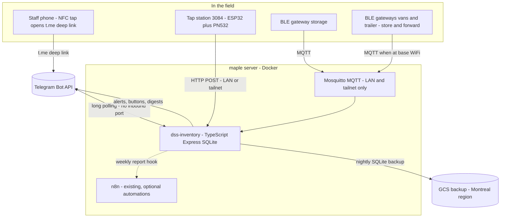
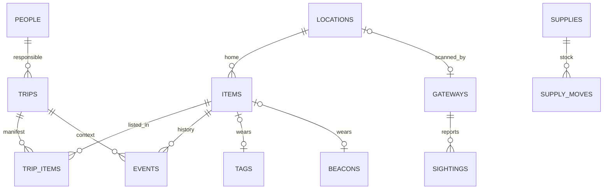
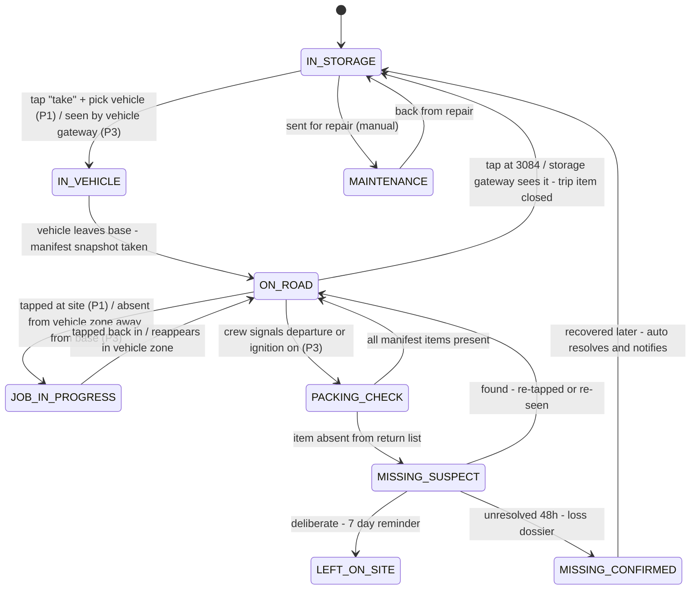

# Software architecture

The backend is a new service, **`dss-inventory`**, built as a faithful sibling of
`telephony-service` — same house style, same server, same conventions. It starts life in
this repo for convenience and **must be extracted to its own repo before production**, per
the rule already stated in `telephony-service/README.md`.

## 1. Where it runs and why the ports matter

Everything runs on **maple** (the existing home server) in Docker. One hard constraint
discovered during design: all three Tailscale Funnel public ports are already taken
(443 = n8n, 8443 = Lupin webhook, 10000 = dss-telephony), and host port 8080 (signal-cli)
and 8090 (dss-telephony) are taken too. So the design needs **zero new public ingress**:

- **Telegram: long polling** (`getUpdates`), not webhooks — outbound HTTPS only.
- **NFC tap deep links** resolve through `t.me` — outbound only.
- **Tap station / BLE gateways** POST to maple over the LAN or the tailnet, never Funnel.
- The service binds `127.0.0.1:8091` on the host (next free port in the house pattern).

## 2. House-style checklist (copied from telephony-service)

- TypeScript 5.x `strict` + `noUncheckedIndexedAccess`, ESM (`NodeNext`, explicit `.js`
  specifiers), Node ≥ 20, compiled with `tsc` — no bundler.
- Express 4; minimal dependencies. New deps: `better-sqlite3` (storage) and `grammY`
  (Telegram long-poll bot). Everything else stays stdlib.
- `src/config.ts` — one typed config object from `.env` with `required()`/`flag()`
  helpers, fail-fast; heavily commented `.env.example`.
- Layout: `src/routes/` (ingest endpoints), `src/pipeline/` (state machine, reconciler,
  packing check), `src/telegram/` (bot, keyboards, FR/ES/EN strings), `src/storage/`
  (SQLite + nightly GCS dump via the existing driver pattern), `scripts/*.mjs`
  (zero-dependency, Node-18-safe operational scripts — e.g. the census CSV importer),
  `test/*.test.ts` on `node:test` for the pure logic (state machine, reconciler, diff).
- Docker: multi-stage build, non-root uid 10001 with `SERVICE_UID/GID`, tini, healthcheck,
  json-file log rotation, `restart: unless-stopped`, loopback-only host bind.
- Deploy: rsync (dry-run first) to `fsulbaran@maple`, `docker compose up -d --build`,
  verify with logs + a writability probe.
- Ingest endpoints authenticated with per-device HMAC keys; idempotent by event dedup key.

## 3. Data model (SQLite, append-heavy)

Designed so the **autonomous Phase 3 needs zero schema rework**: BLE sightings write the
same `events` rows as human taps, just with a different `actor_source` and
`confidence=inferred`.

| Table | Key fields | Notes |
|---|---|---|
| `people` | name, telegram_user_id, lang `fr\|es\|en`, role, active | Freddy, David, crew. Minimal on purpose (Law 25). |
| `locations` | kind `storage\|vehicle\|trailer\|site`, name, plate | "3084 Storage", "Van 1", "Remorque", plus free-form job sites |
| `items` | code `VAC-03`, names FR/EN, category, **serial**, **value_cad**, **photo**, home_location, state, current_location, current_trip, current_responsible, keep_in_vehicle flag | current_* columns are a cache, always re-derivable from `events`. Serial + photo + value make the register insurance-grade. |
| `tags` (NFC) | uid, item_id, model, mounted_on, installed_at, retired_at | separate table → dead tag swaps never lose item history |
| `beacons` (BLE, Phase 3) | mac, item_id, battery_mv, last_seen | same separation |
| `trips` | vehicle, responsible, status `loading\|out\|returning\|closed`, site_label, opened/closed | the unit of the packing check |
| `trip_items` | trip, item, loaded_at, returned_at, resolution `returned\|left_on_site\|missing\|written_off` | **the manifest** the return diff runs against |
| `events` | ts, item, trip, type, from/to location, person, actor_source `phone_tap\|fixed_reader\|ble_gateway\|bot_command\|admin`, confidence `confirmed\|inferred`, lat/lon (nullable), raw_json | **append-only ledger** — corrections are new events (`/fix`), history is never edited |
| `alerts` | kind, refs, chat_id, telegram_message_id, state, resolved_by | lets button callbacks find + edit the original message; idempotency |
| `sightings` (Phase 3) | gateway, mac, rssi, seen_at | raw radio feed, **pruned at 90 days** |
| `supplies` / `supply_moves` | name, qty_on_hand, min_qty / delta, person | bin-level consumables + `/stock` decrements |
| `tag_misses` | tag/beacon, counter | every "the reader missed it" button press increments — tells you which tags to remount |

Retention (Law 25 minimization): raw sightings 90 days; trips/events 12–24 months then
archived; data stays in Canada (maple + GCS `northamerica-northeast1`). Exact retention to
be set deliberately — see the legal notes in
[06-open-questions-and-risks.md](06-open-questions-and-risks.md).

## 4. The item state machine

Rules that make it trustworthy:

- **Any state is correctable** by `/fix VAC-03` — writes a correction event, never edits
  history.
- **Phase 3 inferred transitions** auto-apply but are labeled *"détecté automatiquement —
  [Corriger]"*: a wrong BLE inference costs one tap to undo, and taps always win over radio.
- **Two-checkpoint missing detection**: (1) at the site, before driving away — bot alert +
  in-van buzzer (works offline); (2) on return to base — server-side diff of the trip
  manifest. Catching it at checkpoint 1 is the whole point: the crew can still walk back.
- **Presence debouncing (Phase 3)**: "in zone" = seen in ≥2 of last 3 scan windows; "left"
  = 5 consecutive absent windows; strongest-median-RSSI wins when two zones hear one tag
  (storage gateway will hear into a van parked at the door — this is the #1 tuning task).
- **Offline-tolerant**: vehicle gateways buffer to flash and replay by captured-at
  timestamp with a reordering window; state converges late, never wrongly. (Gateways need
  an RTC strategy — see risks doc.)
- **Nightly reconciliation at a shift-appropriate hour**: anything adrift (no open trip,
  stuck >24 h in progress, unresolved missing, low stock) lands in one digest. Missed taps
  become next-morning corrections instead of silent rot.

## 5. Geolocation — the phone does it, only at tap moments

Exactly as Freddy proposed: no tracker hardware. When a tap flow runs (take / job start /
return), the bot offers a one-tap **"share location"** button (Telegram native
`request_location`). The pin is stored on the *event* — "PRESS-01 job started here" — not
on the person. Optional per event, and it degrades to the site label typed once per trip.
This is inventory context, not movement surveillance; the distinction matters for staff
trust and Law 25 (see doc 06).

## 6. Integration points

- **n8n** (already on maple): optional consumers — weekly summary email, Google Sheet
  export, future client-schedule linkage. Kept **out** of the critical path; the bot logic
  lives in the service where it can be unit-tested. (n8n's Telegram nodes could prototype
  the flows in a weekend, but the button UIs get awkward for dynamic keyboards — verified
  limitation — so the service owns the bot.)
- **Dashboard**: server-rendered read-only pages on the tailnet (where is everything, who
  has what, loss report, print labels). No public exposure; the Firebase marketing site is
  not involved.
- **Backups**: nightly SQLite `.backup` shipped to GCS (existing storage-driver pattern);
  restore runbook in the service README.
- **Future**: AirTag positions stay in Apple Find My (no API) — the register simply records
  which items carry one; a `MISSING_CONFIRMED` alert reminds Freddy to check Find My.

*Next: [04-telegram-flows.md](04-telegram-flows.md).*
