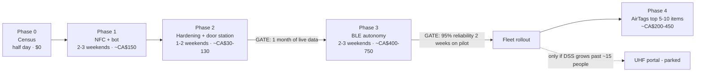

# Roadmap — phases, gates, effort

Every phase ships standalone value, runs to production before the next starts, and **no
phase throws away the previous one's hardware or schema**. The binding constraint is
Freddy-hours (~5–8 weekend-days total through Phase 3), not dollars — sequence accordingly,
and don't start until the currently-open compliance work has the time it needs.

---

## Phase 0 — The census (half a day, $0)

Walk 3084 with a spreadsheet: **code (VAC-01…), name FR/EN, category, serial number,
photo, replacement value, purchase proof if it exists, home shelf**. Import via a
zero-dependency `scripts/import-items.mjs` CSV loader.

**Standalone value:** DSS's first complete equipment register — immediately useful for
insurance (ask the insurer: a serial+photo+value register may earn a premium credit) and
for the GDI subcontract. Even if nothing else ever ships, this is worth the afternoon.

**Also decide now (before any tag order):** kit granularity — tag the caddy or every tool
in it? Which small tools are deliberately untracked? What's rented/client-owned and out of
scope? (Questions list in doc 06.)

## Phase 1 — NFC identity + the full Telegram workflow (2–3 weekends, ~CA$150)

Order the tags (03 hardware doc), stand up `dss-inventory` on maple, deliver **100 % of the
requested workflow** minus autonomy: tap-to-take with vehicle pick, auto pre-assignment,
Freddy's departure alert + assign buttons, responsible person's checklist, the packing
check, `/where`, `/fix`, `/stock`, nightly digest.

**Exit test:** two real weeks of use. Track where taps get skipped — that data decides
what Phase 3 must automate first (and whether it's needed at all).

## Phase 2 — Hardening + the 3084 door station (1–2 weekends, ~CA$30–130)

Fixed tap station at the garage door (covers no-NFC phones; makes storage in/out
one gesture), in-vehicle door tags for batch loading, garage-door reed sensor + the
**after-hours movement alarm**, GCS backups, runbooks (README + ARCHITECTURE.md in house
style), David as escalation fallback, and the repo extraction per the house rule.

**Standalone value:** the system now survives forgetful humans, dead phones and maple
mishaps — and watches the storage at night.

## Phase 3 — BLE autonomy (2–3 weekends + hardware, ~CA$400–750)

**Gate to enter:** one month of Phase 1–2 data showing missed-tap hotspots; site survey
done (Wi-Fi reach at the garage door, power outlet, maple's LAN position); granularity
decisions locked.

Order: **storage gateway first** (no-code ESPHome — a weekend, instant value: automatic
"left storage" detection + real after-hours coverage), then the harder part: **vehicle
gateways** with custom NimBLE store-and-forward firmware, 12 V installs, the in-van
buzzer packing check, presence reconciler + debouncing, battery/STALE digests.

**Gate to fleet:** ≥95 % presence-detection reliability over two weeks on the pilot
vehicle, measured with deliberate leave-an-item-behind drills — *the* ground truth. Miss
the bar → stay tap-first, money saved, nothing wasted.

**Winter plan (Quebec is not optional):** run the first winter as a pilot — coin cells
fade below −20 °C, consumer ESP32/SD/LTE parts are 0–40 °C rated, condensation cycling
kills electronics in vans, gloves can't tap NFC. Expect January false-STALE storms and
plan the battery/enclosure strategy per season. Details in doc 06.

**Optional add-on, decide after living with it:** LTE router in the main van
(~CA$140 + $15/mo) turns "you find out tonight" into "you find out at 11 a.m.". The buzzer
may make this unnecessary.

## Phase 4 — AirTags for the expensive machines (a Saturday, ~CA$200–450)

Exactly per Freddy's idea: the 5–10 machines worth $1,000+ get an AirTag 2 in a hidden
screw-down mount. Recovery tool for true walk-aways; register records which items carry
one. Needs one Apple device in the company.

## Parked — UHF RFID portal

The genuine walk-through-the-door tech. Revisit only if headcount passes ~15 and tap+BLE
compliance measurably fails: ~CA$2,000–2,600/door (Impinj R700 $1,499 or Zebra FX7500
~$1,050 + antennas + PoE+ + Pi), on-metal tags, 90–99 % reads on wet metal, ISED-certified
gear only. The event model already accepts a portal as just another `actor_source` — no
rework, only money.

## Kill criteria (honesty clause)

The system is declared failed and rolled back to manual-Telegram mode if, over any month:
false alerts exceed ~2/week sustained (trust death), or the packing check misses >1 real
forgotten item verified by drills, or Freddy's maintenance time exceeds ~2 h/month.
Better an honest spreadsheet than a distrusted robot.

## Effort summary

| Phase | Freddy-days | Cash | Cumulative cash |
|---|---|---|---|
| 0 | 0.5 | $0 | $0 |
| 1 | 4–6 evenings/2–3 wk-ends | CA$100–150 | ~CA$150 |
| 2 | 1–2 wk-ends | CA$30–130 | ~CA$180–280 |
| 3 | 2–3 wk-ends | CA$400–750 | ~CA$580–1,030 |
| 4 | 0.5 | CA$200–450 | ~CA$780–1,480 |

Monthly: **$0** (Telegram free, maple already runs, SQLite local, GCS pennies) unless the
optional LTE vans are added (~CA$15/mo each). Steady-state maintenance: ~1–2 h/month
(battery trickle, digest review, occasional tag remount).

*Next: [06-open-questions-and-risks.md](06-open-questions-and-risks.md) — answer the
questions before ordering anything.*
