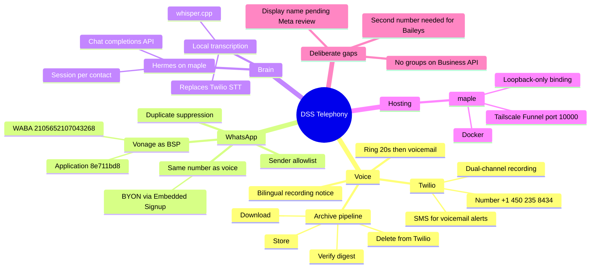
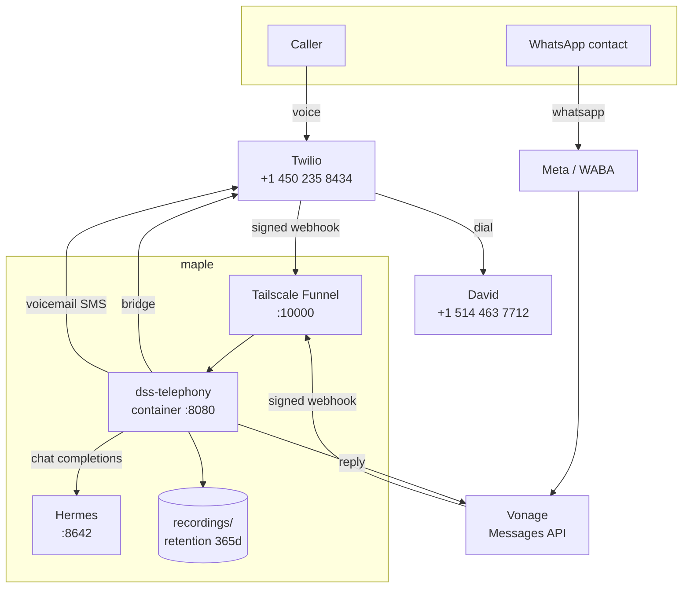
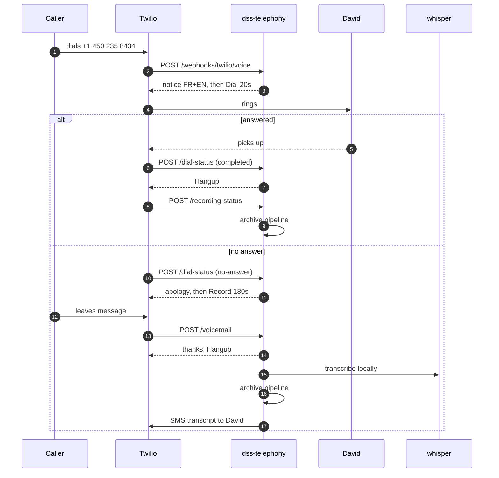
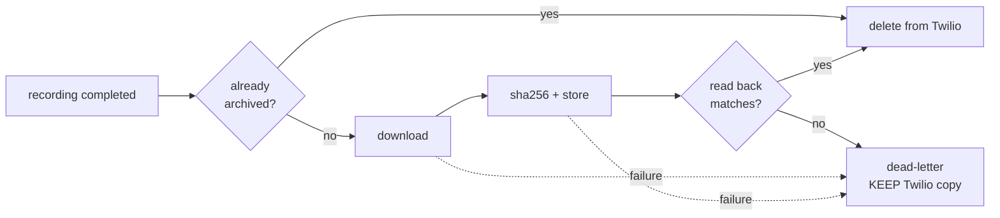
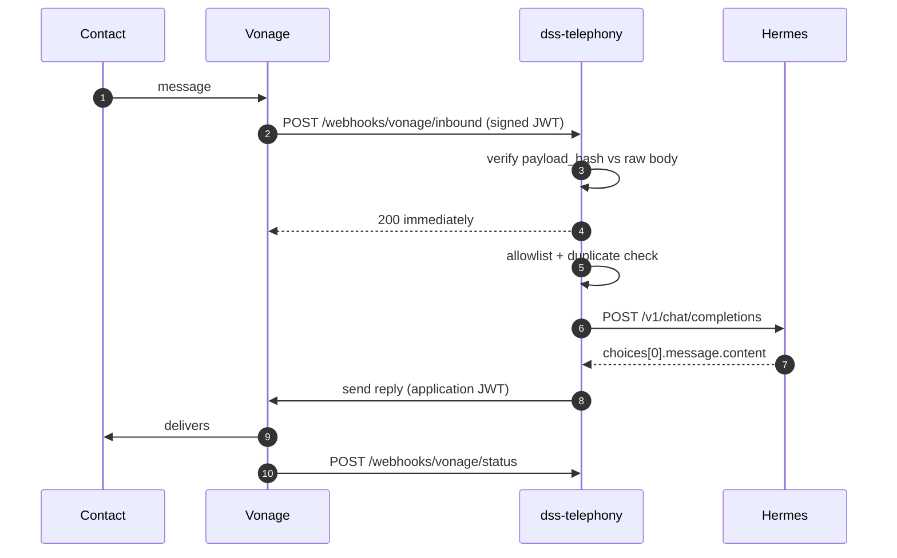

# DSS Telephony — Architecture

Voice and WhatsApp for DSS Multiservices. Twilio carries voice, Vonage carries
WhatsApp, Hermes answers, and everything expensive happens locally.

Operational detail — env vars, runbooks, how to redeploy — lives in
[README.md](../README.md). This document is the shape of the system and the
reasoning behind it.

## The whole system at a glance

## Topology

The container binds `127.0.0.1:8090` only. Funnel proxies from localhost, so the
service is never reachable from the LAN — the webhook endpoints are
authenticated, but the recording archive is not something to expose broadly.

## Voice call

The recording notice plays **before** `<Dial>`, not inside it. Recording both
legs of a call in Quebec means telling the caller first; announcing it after the
bridge opens would be too late to be consent.

`<Dial>` carries an `action` URL. Without one an unanswered call falls off the
end of the TwiML document and hangs up on the customer.

**Known collision:** David is on Rogers, whose own voicemail typically diverts
around 20–25 s. If it answers first, Twilio reports `completed`, our voicemail
branch never runs, and the message lands on his personal voicemail with no
transcript, no archive and no SMS. It looks like success from every log we keep.
Ring time is held at 20 s to stay under it; the durable fix is disabling the
carrier divert.

## Recording archive

The ordering is the whole point. The original brief called for deleting the
Twilio copy immediately after upload, but "after upload" is not "after the
upload is known good": a store that accepts a write and loses it, or a truncated
transfer, would permanently destroy a customer call with no copy anywhere. The
delete is gated on a read-back whose size and SHA-256 match what was computed
before writing.

Failure keeps the Twilio copy and dead-letters the event. Retaining a recording
costs fractions of a cent; losing one is unrecoverable.

The webhook returns 500 on failure so Twilio retries, and `archiveRecording` is
idempotent so retries are safe.

## WhatsApp

The ack goes out **before** Hermes is called. An agent run takes tens of seconds
and Vonage retries on a slow ack, which would become a second agent run and a
duplicate reply. `claimMessage` suppresses duplicates on top of that.

Inbound text is wrapped in an envelope labelled untrusted, and routing metadata
is supplied by the service rather than read from the message body — otherwise a
contact could type `from: ...` and forge it.

Two auth schemes meet here and they are easy to confuse:

| Direction | Auth | Failure mode |
|---|---|---|
| Vonage to us | HS256 JWT, `payload_hash` vs raw body | 403 |
| Us to Vonage | RS256 application JWT | **401 with no explanation** |

Basic auth works against the sandbox and fails against production once the
number is linked to an application. That 401 cost us a debugging round.

## Deployment

| | |
|---|---|
| Host | maple, Docker |
| Public URL | `https://maple.tail661853.ts.net:10000` |
| Port chain | Funnel 10000 → host 8090 → container 8080 |
| Image | Node 20 + ffmpeg + whisper.cpp, non-root user |
| Model | `ggml-base-q5_0.bin` as a read-only volume |
| Secrets | `.env`, mode 600, including the Vonage PEM inline |

Host 8090 because signal-cli holds 8080. Funnel allows only 443, 8443 and 10000;
the first two were taken by n8n and another webhook.

whisper.cpp is compiled in a build stage rather than installed on maple, so the
host keeps its Node 18 and gains no build toolchain.

The Vonage private key travels **inside `.env`**, not as a mounted file. The
container runs as a non-root user whose uid does not match the host owner, so a
bind-mounted 600 key is unreadable. Vonage issues that key once and never again.

## Why not the providers' own tooling

Twilio Studio could do "ring, then voicemail" with no server at all. It cannot
download a recording, verify it, delete the Twilio copy, and transcribe it
locally — which is the entire cost argument.

Hermes' gateway speaks WhatsApp natively, but only via Baileys or Meta Cloud
API, never Vonage. Keeping Vonage as BSP is exactly why the bridge in
`src/hermes.ts` has to exist.

## Cost model

| Line item | Basis | Monthly at ~15k min |
|---|---|---|
| Twilio transcription **avoided** | $0.05/min | **~$780 saved** |
| Twilio voice | ~$0.014/min | ~$200 |
| Twilio recording | $0.0025/min | ~$39 |
| Recording storage | ~30 GB/mo of WAV | $0.60 – $12 |
| Hermes tokens | ~33k prompt/message | **unmeasured, potentially dominant** |

Storage tier is a rounding error; `RETENTION_DAYS` is what actually bounds it,
and 365 days is also the defensible answer under PIPEDA.

The agent context is the one line that can quietly eat the savings, because it
appears on no telephony invoice. Every reply logs its `promptTokens` so the
number stays visible.

## Decisions

**Two WhatsApp numbers are required.** Groups only exist on the personal
Baileys side; the Business API is strictly 1:1. The 450 is the official line;
group ingestion for KAKU needs a separate, disposable number, because Meta bans
numbers for Baileys with no appeal.

**Vonage stays as BSP for now.** Migrating to Hermes' native `whatsapp-cloud`
is deferred, not rejected — the near-term goal is real cost data rather than a
second migration. Revisit with a month of billing, knowing the original
justification does not hold: WhatsApp rates are set by Meta and apply across
BSPs, so Vonage competes on markup alone.

**Voicemail alerts go by SMS.** A business-initiated WhatsApp outside the
contact's 24-hour window needs an approved template, and none exists.

## Open

- `+1 226 277 0423` is linked to nothing and still billing
- Display name "Esperancita" pending Meta review; a first-name-only display name
  for a company account is the kind Meta rejects
- The persona is an AI agent behind a human name and photo — a disclosure line
  in the WhatsApp About field is the cheap mitigation
- Toll-free verification requirement was never specified
- No automated test suite; everything here was verified by hand against live
  services
- Three stale recordings on Twilio, including a consumed OTP
