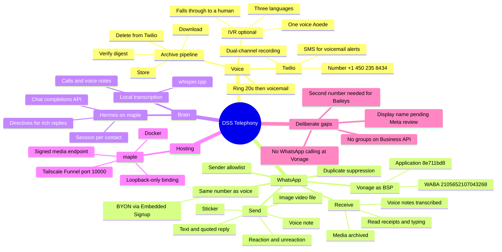
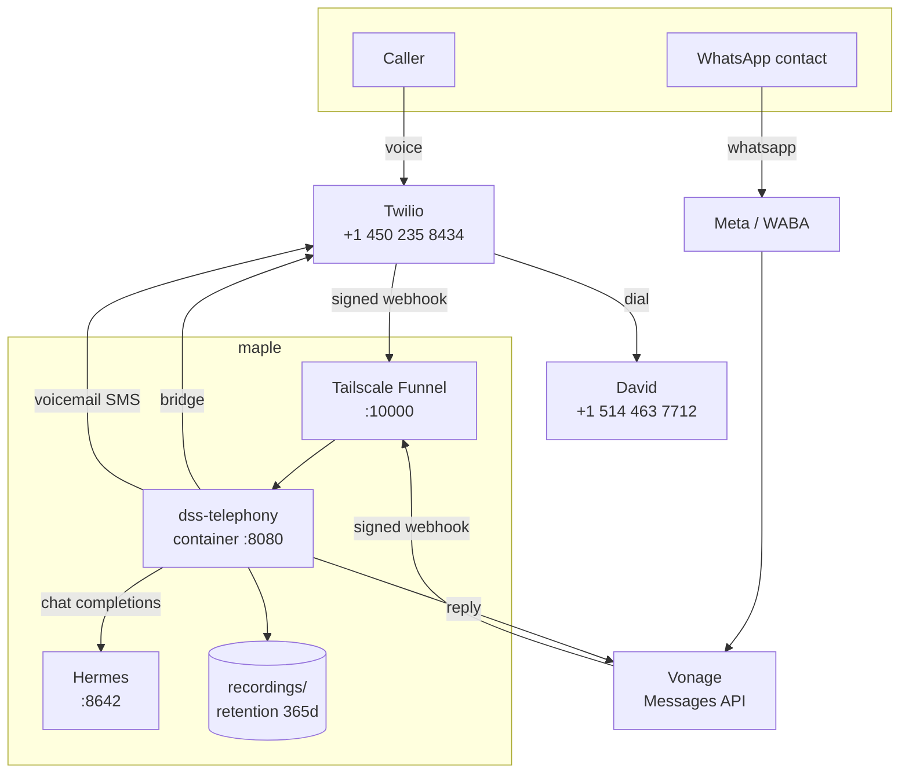
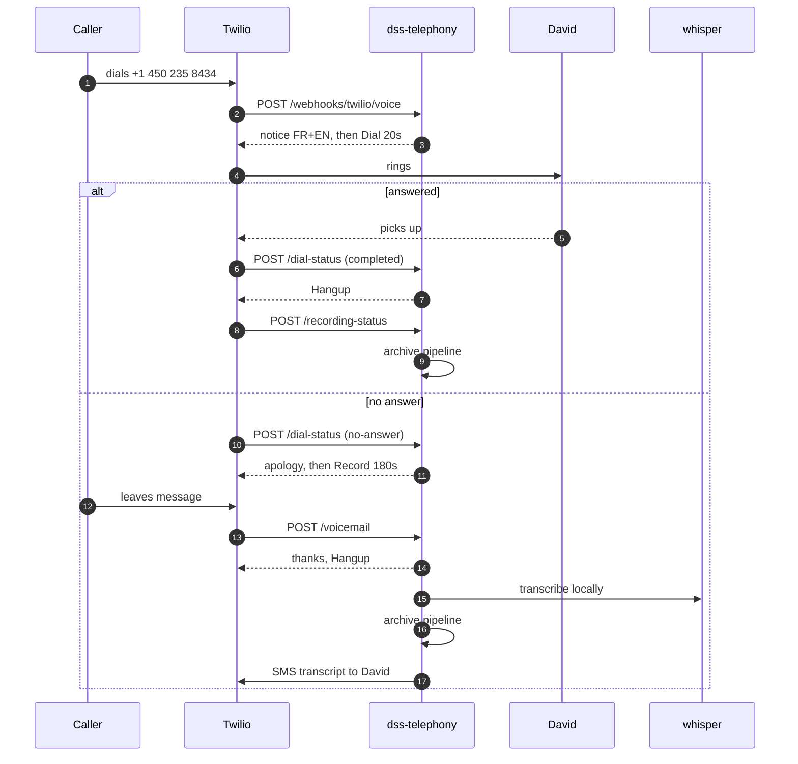
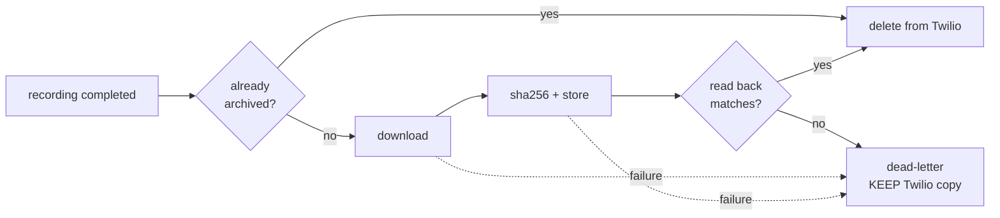
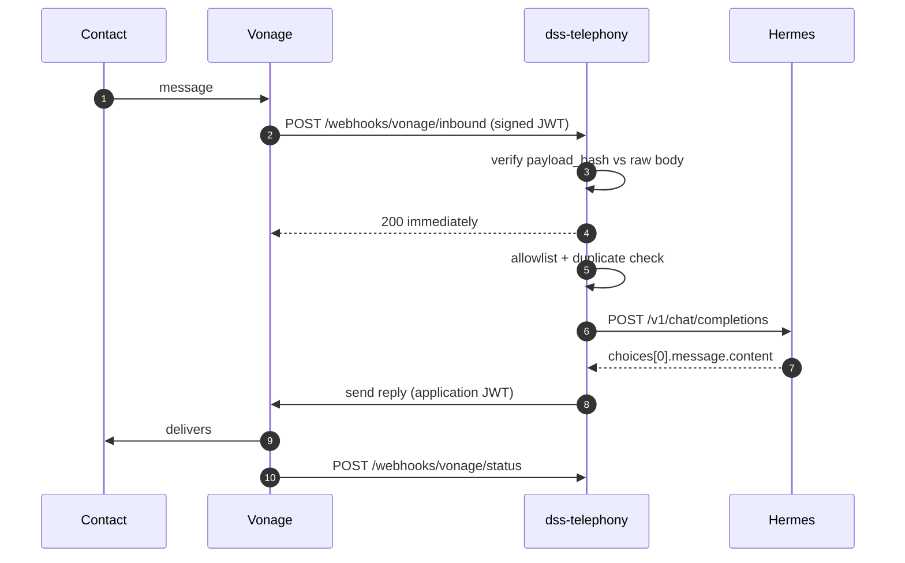

# DSS Telephony — Architecture

Voice and WhatsApp for DSS Multiservices. Twilio carries voice, Vonage carries
WhatsApp, Hermes answers, and everything expensive happens locally.

Operational detail — env vars, runbooks, how to redeploy — lives in
[README.md](../README.md). This document is the shape of the system and the
reasoning behind it.

## The whole system at a glance



## Topology



The container binds `127.0.0.1:8090` only. Funnel proxies from localhost, so the
service is never reachable from the LAN — the webhook endpoints are
authenticated, but the recording archive is not something to expose broadly.

## Voice call



### The menu

`IVR_ENABLED` puts a three-language menu in front of the bridge: 1 reaches a
person, 2 leaves a message, 9 and 8 change language. It is **off by default**,
because the ring window above was tuned against a live carrier and a menu
spends some of the caller's patience before that window even opens.

Two rules keep it from becoming a trap. A caller who presses nothing twice is
transferred rather than looped — a dead keypad or a rotary phone must still
reach someone. And anything unrecognised falls through to a human, so an input
nobody anticipated fails toward service rather than toward a hang-up.

The recording notice moves inside the menu when it is on, so it is still heard
before any bridge opens.

### The voice

All three languages speak as `Chirp3-HD-Aoede`, Google's generative tier, which
is the only family carrying one voice name across fr-CA, en-US and es-US. That
is what lets the line sound like one person rather than three narrators.
`fr-CA`, not `fr-FR`: a Parisian voice on a Montreal line reads as offshore.

This replaced `Polly.Chantal` and `Polly.Joanna`, both *standard* tier — the
oldest and most obviously synthetic voices Twilio still offers.

Generative voices are not enabled on every Twilio account, and an unavailable
voice does not fail loudly. `VOICE_TIER=neural` steps down to
`Polly.Gabrielle-Neural` / `Joanna-Neural` / `Lupe-Neural`, and
`VOICE_OVERRIDES=fr=Google.fr-CA-Chirp3-HD-Kore` swaps a single one — the
catalogue changes on Twilio's schedule, so this has to be an env change rather
than a deploy.

The recording notice plays **before** `<Dial>`, not inside it. Recording both
legs of a call in Quebec means telling the caller first; announcing it after the
bridge opens would be too late to be consent.

`<Dial>` carries an `action` URL. Without one an unanswered call falls off the
end of the TwiML document and hangs up on the customer.

**Known collision:** David is on Rogers, whose own voicemail typically diverts
around 20–25 s. If it answers first, Twilio reports `completed`, our voicemail
branch never runs, and the message lands on his personal voicemail with no
transcript, no archive and no SMS. It looks like success from every log we keep.
Ring time is held at 20 s to stay under it; the durable fix is disabling the
carrier divert.

## Recording archive



The ordering is the whole point. The original brief called for deleting the
Twilio copy immediately after upload, but "after upload" is not "after the
upload is known good": a store that accepts a write and loses it, or a truncated
transfer, would permanently destroy a customer call with no copy anywhere. The
delete is gated on a read-back whose size and SHA-256 match what was computed
before writing.

Failure keeps the Twilio copy and dead-letters the event. Retaining a recording
costs fractions of a cent; losing one is unrecoverable.

The webhook returns 500 on failure so Twilio retries, and `archiveRecording` is
idempotent so retries are safe.

## From audio to something readable

Every recording produces three artifacts, side by side under the same date
prefix so they are found and expire together:

```
recordings/2026/08/10/RE….wav              the audio
recordings/2026/08/10/RE….transcript.json  who said what, when, in which language
recordings/2026/08/10/RE….summary.json     what it was about and what to do
```

### Why the transcript is built per utterance

Whisper assigns **one language to the whole audio**. It is not a per-phrase
classifier. On a real bilingual call from the 450 line it chose French at
p=0.91 and pushed all 46 seconds through a French model, so the English and
Spanish stretches came back as French phonetics — "Le SSC", "je vais besoin des
emplois". In Montreal that is the normal case, not an edge case.

So the recording is cut into utterances first: silence detection per channel,
then a language decision per piece. That also solves a second problem found the
same evening — splitting the stereo file into two whole-channel files makes
things *worse*, because each channel is mostly silence while the other person
talks and whisper invents text to fill it ("ça va t'expliquer pour les
autorités", nine times). Cutting the silence out is what prevents it.

Utterances too short to carry gradeable grammar inherit the language of the
last confident one. People switch language between thoughts, not between "oui"
and the sentence it answers.

**A correction worth keeping.** The staff side was originally pinned to Spanish,
on the grounds that DSS employees mostly speak it. Measured against a real call,
that was wrong: David was speaking French and English, and every one of his
utterances came back forced through Spanish — "Ok, el beso de la abril, chiquo,
la lura" out of ordinary French. It was a prior, not a fact. Both sides are now
scored across all three candidates, and the prior survives only as the
tie-break for utterances too short to score.

### Model choice

Measured on that same call, which is now the reference fixture:

| Model | Time for 46s | Verdict |
|---|---|---|
| base-q5_0 | 52s | invents English where there is French |
| small-q5_1 | 131s | closer, still garbles |
| **large-v3-turbo-q5_0** | **616s** | the only one to produce "les fonds de salubrité santé" |

Later measured against the full `large-v3` as well, once ground truth for the
call was known — the caller had been trying to say **"Fonds des services de
santé"**, in French, and fumbling it:

| | at 0:31 | verdict |
|---|---|---|
| large-v3-turbo | `les fonds de salubrité santé` (fr) | right language, nearly the phrase |
| large-v3 | `los fondos de salud` (es) | right meaning, wrong language |

**turbo wins, and it is not the intuitive answer** — the bigger model is not the
more accurate one here. It costs twice the disk and produced different answers
rather than better ones. Without asking what was actually said, this comparison
was unresolvable; both outputs are plausible and they disagree.

### Where the cost actually is

The three language passes were blamed for the 13× first, and that was wrong.
Measured, one `-l auto` pass took **668s against 616s** for three scored passes
— slower, and it labelled an "OK OK" as Korean, a language not among the
candidates.

The real breakdown, for one invocation on a 5-second clip:

```
load time  =    241 ms
encode time = 14,441 ms
```

Whisper encodes a **30-second window whatever it is given**. Sixteen utterances
× three languages is 48 invocations each paying for half a minute it never
used, on a call 46 seconds long. That is the 13×.

Packing consecutive same-speaker turns up to 28s cuts it to 347s — 44% — and is
implemented, tested and **off by default**, because it merged three turns into
one Spanish-scored blob and turned "J'ai besoin de savoir c'est quoi le… S-F-C"
into "Se puede saber que se puede saber que se puede saber". Transcript accuracy
is the priority and a late summary is acceptable, so throughput loses.

What is applied, because it costs nothing: **8 threads** per invocation instead
of the default 4. Measured on maple's 12 cores — 4 threads 44.7s, 8 threads
35.0s, 12 threads 41.6s. Past 8 it contends with the rest of the box.

### Vocabulary hints

`--prompt` biases whisper toward terms it has little reason to know. "Fonds des
services de santé" coming back as "fonds de salubrité santé" is exactly the
shape of error a glossary fixes: trade vocabulary, acronyms and Quebec street
names, said all day here and rarely anywhere else.

Split per language, and deliberately so. Every candidate pass is compared
against the others to decide the language, so attaching French terms to the
Spanish pass would bias that pass toward French and rig the comparison it
feeds. Only the shared half — names, acronyms, streets — is language-neutral.

The risk to watch is bleed: an initial prompt can push a model into emitting
glossary terms nobody said, especially on unclear audio. Keep the list short,
and check a transcript after changing it.

### Where the summary runs, and why it is not in the container

**The container does telephony; the host does AI.** Webhooks, signatures, TwiML,
whisper and the archive are containerised. Claude Code, Hermes and ollama all
live on maple itself, and the summariser goes to them rather than the reverse.

The immediate reason is practical: `claude` lives in `~/.local/bin` with
credentials in `~/.claude`, and neither belongs inside an image. Baking them in
would put account credentials in a container and grow the image to carry a
second agent runtime.

The structural reason is better. Moving the whole service to the host was the
alternative considered, and rejected on measurement: maple runs **Node 18**
while the service needs 20+, and `whisper-cli` exists only inside the image. It
would mean upgrading the host's Node — shared with signal-cli, n8n, Hermes and
ollama — and growing a build toolchain there, to gain access the host already
has. The recordings directory is a bind mount; the audio, transcripts and
summaries are already plain files under `~/dss-telephony/recordings`.

So the seam is a **directory, not a protocol**. The service writes
`RE….transcript.json`; a systemd user timer notices one with no matching
`RE….summary.json` and fills it in. That makes it a queue for free: if Claude is
down or a usage limit is spent, the next run picks up exactly what was missed.

```
scripts/summarise-host.mjs        zero dependencies, Node 18, runs on the host
scripts/systemd/dss-summarise.*   timer, every 10 minutes, Persistent=true
```

The honest cost of this split is two places to look when something breaks, and
two deploy paths. It is tolerable because the contract between them is "a file
appeared".

The in-service summariser is kept and `SUMMARISE_CALLS` defaults to off, so the
same job can run either side without a code change — useful if Claude Code ever
stops being available on the host.

**Why not Hermes for this.** Hermes reports running `gpt-5.6-luna`, and its
usage shares a weekly workspace limit with Codex and the other agents already
running there. Summaries are stateless batch work that nobody is waiting on, so
they are the easiest thing to move off a contended pool. The WhatsApp assistant
stays on Hermes: that is where Esperancita's persona and each contact's memory
live, and neither travels.

Measured on the same reference call, Claude Code produced the better summary —
it identified the call as a system test, which Hermes did not — in 13 seconds.

### Summaries

A transcript is a record; a summary is what makes it usable. Hermes reads the
transcript and returns a summary, the follow-up actions, and a topic. It is
already the brain of this service and already reachable, so summarising at write
time costs one completion and saves every later reader from re-deriving it.

The reply is parsed from labelled sections rather than JSON — the same
reasoning as the WhatsApp directives. A model that fumbles JSON returns nothing
usable; a model that fumbles a heading still returns prose a human can read, and
an unparseable reply becomes the summary verbatim rather than disappearing.

The transcript is handed over labelled as unreliable data and explicitly not as
instructions, because it is unreviewed text from an outside caller arriving at
an agent.

## WhatsApp



The ack goes out **before** Hermes is called. An agent run takes tens of seconds
and Vonage retries on a slow ack, which would become a second agent run and a
duplicate reply. `claimMessage` suppresses duplicates on top of that.

Inbound text is wrapped in an envelope labelled untrusted, and routing metadata
is supplied by the service rather than read from the message body — otherwise a
contact could type `from: ...` and forge it.

Two auth schemes meet here and they are easy to confuse:

| Direction | Auth | Failure mode |
|---|---|---|
| Vonage to us | HS256 JWT, `payload_hash` vs raw body | 403 |
| Us to Vonage | RS256 application JWT | **401 with no explanation** |

Basic auth works against the sandbox and fails against production once the
number is linked to an application. That 401 cost us a debugging round.

### What the line can send and receive

| | Send | Receive |
|---|---|---|
| Text | yes | yes |
| Quoted reply | yes, with fallback | yes, `context.message_uuid` |
| Image, video, file | yes | archived |
| Voice note | yes | archived **and transcribed** |
| Sticker | yes, `.webp` only | archived |
| Reaction / unreaction | yes | logged, no agent run |
| Location | — | passed to the agent as coordinates |

`context` is documented by Vonage for reactions and only implied for ordinary
messages, so a quoted send that comes back 4xx is retried once **without** the
quote. Losing the quote is survivable; dropping the customer's answer is not.

Inbound media is fetched immediately rather than queued, because Vonage expires
it. Voice notes then go through the same local whisper that handles call
recordings — without that step the agent, which reads text only, would silently
ignore anyone who prefers talking to typing.

That path was exercised inside the container, not assumed: WhatsApp sends
OGG/Opus rather than WAV, and ffmpeg decodes it in 0.13s with whisper adding
1.7s on the base model for a 9-second clip.

**Language is decided on the text, not the audio.** Whisper's own detector
called a French clip English at p=0.93, and the failure is not a degraded
transcript but phonetic nonsense. A fixed `fr` handles English fine and mangles
Spanish. Since no single setting serves all three, customer audio is
transcribed once per candidate language and the results are scored on how much
each looks like the language it claims to be — grammar survives a mangled pass
where content words do not. Three local passes cost ~5s of our own CPU, which
is only a reasonable trade because nobody bills us per minute.

Who is speaking is the actual variable, and it splits four ways: customers use
all three languages, DSS employees are mostly Spanish-speaking, and Meta's
verification robot only ever speaks English. The employee setting is inert
until dual-channel recordings are transcribed per channel rather than
downmixed — which is now justified twice over, by diarization and by language.

Reactions are recorded but do not trigger an agent run. A thumbs-up is an
acknowledgement, and answering one would cost a completion and earn the
customer an unsolicited reply.

### How the agent reaches the rich types

Hermes returns text and has no tool surface pointed at Vonage — and it
configures itself, so giving it one is not ours to do. The seam is a small
directive vocabulary the agent can emit inside its completion:

```
::react 👍          ::image <url> | caption      ::audio <url>
::unreact           ::video <url> | caption      ::sticker <url>
::reply             ::file  <url> | name.pdf     ::call
```

Line-based rather than JSON on purpose. A model that emits slightly malformed
JSON produces nothing; a model that fumbles a directive line produces a message
with one odd line in it, which the customer can still read. Unrecognised
directives stay in the prose for the same reason. A completion with no
directives behaves exactly as it did before this existed.

### Serving outbound media

WhatsApp fetches attachments by URL, so anything we send has to be reachable
from the public internet — which this service already is, through Funnel. That
makes exposure, not reachability, the problem.

`MEDIA_ROOT` is a **separate directory from the recordings archive**, links are
HMAC-signed over path *and* expiry together, and they expire. The archive is
deliberately not servable: a signed link to a customer call is one forwarded
message away from being a disclosure. Public `https` URLs pass through
unsigned; plaintext `http` is refused rather than downgraded.

### WhatsApp calling

**Not available to us.** Meta opened the WhatsApp Business Calling API to
businesses through their BSPs, but Vonage publishes no calling endpoints, no
webhook contract and no code snippets for it — checked across their API
reference, the WhatsApp concept guide and their announcements.

Two things follow. First, no handler was written against a payload shape nobody
has documented; `/webhooks/vonage/calls` exists only to log and loudly flag an
event if Vonage ever ships one, so the contract can be read off something real.
Second, even if it arrived, **WhatsApp has no native call recording** — some
BSPs bolt it on — which conflicts with an architecture whose whole premise is
that every call is recorded, verified and archived.

What works today is deflection: `::call` hands the customer the PSTN number,
which is the same number this WhatsApp account runs on, where the IVR answers
and the recording pipeline already applies.

## Deployment

| | |
|---|---|
| Host | maple, Docker |
| Public URL | `https://maple.tail661853.ts.net:10000` |
| Port chain | Funnel 10000 → host 8090 → container 8080 |
| Image | Node 20 + ffmpeg + whisper.cpp, non-root user |
| Model | `ggml-base-q5_0.bin` as a read-only volume |
| Secrets | `.env`, mode 600, including the Vonage PEM inline |
| Source on maple | a **loose copy**, not a git clone — sync with rsync |

Host 8090 because signal-cli holds 8080. Funnel allows only 443, 8443 and 10000;
the first two were taken by n8n and another webhook.

`~/dss-telephony` on maple is not a checkout, so `git pull` does nothing there.
Deploys are an rsync of the source excluding `.env`, `node_modules`, `dist`,
`recordings`, `deadletter`, `models` and `media`, then a rebuild.

### The container runs as the volume owner

`SERVICE_UID`/`SERVICE_GID` set the container's uid to whoever owns the bind
mounts. This is not tidiness.

Compose creates missing bind-mount directories as whoever runs it, so bringing
the service up under `sudo` left `recordings/` and `deadletter/` owned by
`root:root` while the container ran as uid 10001. The container could not write
to either, and nothing said so: archival would have failed on the first real
call, and the dead-letter meant to record that failure would have failed with
it. The Twilio copy survives — deletion is gated on a verified write — so
nothing would be lost, but nothing would be kept locally either.

The lesson generalises past this one bug. Operate maple as `fsulbaran`, and
check writability after a deploy rather than assuming it:

```
docker exec dss-telephony sh -c 'touch /app/recordings/.probe && rm /app/recordings/.probe'
```

### Availability depends on Tailscale, not just on maple

The public webhook URL reaches us through Funnel, which ingresses at Tailscale's
edge. On 2026-08-10 maple lost its DERP relay and its connection to Tailscale's
control plane for about thirty minutes:

```
derp.Recv(derp-21): connect to region 21 (tor): context deadline exceeded
PollNetMap: Post ".../machine/map": context deadline exceeded
```

The line was genuinely unreachable from the outside during that window. What
makes this worth writing down is that **nothing in the service noticed**: the
host never rebooted, the container never restarted, its logs stayed clean, and
the archive counters read zero exactly as they would on a quiet night. Diagnose
this class of outage with `journalctl -u tailscaled` on maple, never with
`docker logs`.

maple routes via a relay rather than a direct connection, so a third party's
availability is inside the dependency chain of a customer-facing phone line.
That is a reasonable trade for a lab box and a deliberate decision to revisit
for a business line.

whisper.cpp is compiled in a build stage rather than installed on maple, so the
host keeps its Node 18 and gains no build toolchain.

The Vonage private key travels **inside `.env`**, not as a mounted file. The
container runs as a non-root user whose uid does not match the host owner, so a
bind-mounted 600 key is unreadable. Vonage issues that key once and never again.

## Why not the providers' own tooling

Twilio Studio could do "ring, then voicemail" with no server at all. It cannot
download a recording, verify it, delete the Twilio copy, and transcribe it
locally — which is the entire cost argument.

Hermes' gateway speaks WhatsApp natively, but only via Baileys or Meta Cloud
API, never Vonage. Keeping Vonage as BSP is exactly why the bridge in
`src/hermes.ts` has to exist.

## Cost model

| Line item | Basis | Monthly at ~15k min |
|---|---|---|
| Twilio transcription **avoided** | $0.05/min | **~$780 saved** |
| Twilio voice | ~$0.014/min | ~$200 |
| Twilio recording | $0.0025/min | ~$39 |
| Recording storage | ~30 GB/mo of WAV | $0.60 – $12 |
| Voice-note transcription **avoided** | local whisper | small but unbounded |
| Generative TTS | per character, above standard tier | a few cents per call |
| Hermes tokens | ~33k prompt/message | **unmeasured, potentially dominant** |

Storage tier is a rounding error; `RETENTION_DAYS` is what actually bounds it,
and 365 days is also the defensible answer under PIPEDA.

The retention sweep used to match `.wav` only, which quietly exempted every
WhatsApp photo, document and voice note — the sweep ran clean while the data it
was meant to remove accumulated. It now covers both prefixes and every
extension. Worth knowing that the bug was invisible from the logs.

The agent context is the one line that can quietly eat the savings, because it
appears on no telephony invoice. Every reply logs its `promptTokens` so the
number stays visible.

## Decisions

**Two WhatsApp numbers are required.** Groups only exist on the personal
Baileys side; the Business API is strictly 1:1. The 450 is the official line;
group ingestion for KAKU needs a separate, disposable number, because Meta bans
numbers for Baileys with no appeal.

**Vonage stays as BSP for now.** Migrating to Hermes' native `whatsapp-cloud`
is deferred, not rejected — the near-term goal is real cost data rather than a
second migration. Revisit with a month of billing, knowing the original
justification does not hold: WhatsApp rates are set by Meta and apply across
BSPs, so Vonage competes on markup alone.

**Voicemail alerts go by SMS.** A business-initiated WhatsApp outside the
contact's 24-hour window needs an approved template, and none exists.

## Open

- `+1 226 277 0423` is linked to nothing and still billing
- Display name "Esperancita" pending Meta review; a first-name-only display name
  for a company account is the kind Meta rejects
- The persona is an AI agent behind a human name and photo — a disclosure line
  in the WhatsApp About field is the cheap mitigation
- Toll-free verification requirement was never specified
- Three stale recordings on Twilio, including a consumed OTP
- No real inbound call has ever run: voicemail, archive and the SMS
  notification are untested against an actual caller
- The line's reachability depends on Tailscale's control plane and a DERP
  relay, with no alerting when either drops
- Employee-side language (mostly Spanish) is inert until dual-channel
  recordings are transcribed per channel instead of downmixed
- Hermes prompt tokens (~33k/message) remain unmeasured and appear on no
  telephony invoice
- The IVR is verified against the running service but has never carried a real
  call; ring timing under Rogers still needs re-measuring with the menu on
- Outbound media has never been sent to a real handset — every message type is
  built to Vonage's published shape, none is confirmed against a device
- `npm test` covers the pure logic (directive parsing, media signing and path
  escape, IVR routing, inbound classification). Everything touching a provider
  is still verified by hand.
